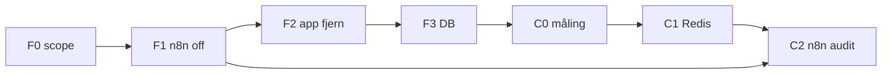

# Coolify / infrastruktur — Alternativ C + forum-fjerning

Dette dokumentet er plan + runbook for Alternativ C og forum-fjerning.
**App-fjerning (F2) + DB DROP (F3c) er implementert** på `cursor/remove-forum-c641`.
Gjenstår: C0 egress-måling, C1 Redis, F1 pause av eventuelle aktive forum-n8n i prod.

Det beskriver:

1. **Alternativ C** — fortsatt **hosted Supabase**, redusert egress via Coolify (Redis, cache-disiplin, n8n/ops), uten full self-host av Postgres ennå.
2. **Full fjerning av forum** fra produktet — alt bruker-/admin-UI, API, n8n-pipeline og DB-funksjonalitet knyttet til forum/reels.

Relatert produktarbeid: avstemninger/initiativ (PR #57, `polls` / `citizen_initiatives`) må **avkobles fra forum** før eller under forum-fjerning.

---

## Overordnet mål

| Mål | Indikator |
|-----|-----------|
| Lavere Supabase egress | Dashboard + logg: færre store SELECT, færre n8n full-table scans |
| Enklere produkt | Ingen `/dashboard/forum/*`, ingen forum i nav, ingen reels-pipeline |
| Stabil drift på Coolify | Redis for app-cache; n8n + Ollama + SearXNG som i dag |
| Bevare kjernen | Stortinget-saker, sak-stemming (`citizen_votes`), høringer (`hearing_comments`), avstemninger |

---

## Alternativ C — faser (nærmere)

### Fase C0 — Baseline og måling (1–2 dager arbeid)

**Gjør:**

- Supabase Dashboard → **Database** → egress / query insights (7 og 30 dager).
- Liste topp-kallere:
  - App: `lib/stortinget-saker-cache.ts`, `lib/stortinget-detail-cache.ts`, `lib/forum/queries.ts` (fjernes), document chunks / RAG.
  - n8n: workflows som SELECT fra Postgres uten `LIMIT` (forum-prompts, embeddings, AI summary med `detail_json`).
- Dokumenter nåværende Coolify-tjenester: n8n, Ollama, SearXNG (`infra/searxng/`).
- Definer **SLO**: mål egress % reduksjon etter C1+C2 (f.eks. −30 % mot baseline).

**Leveranse:** tabell «kilde → estimert egress → tiltak» i dette filens appendix (oppdateres etter C0).

### Fase C1 — Redis på Coolify (app read-cache)

**Gjør:**

- Ny stack under `infra/coolify/redis/` (docker-compose eller Coolify service template):
  - Redis 7, passord, ingen offentlig port (kun privat nett / Tailscale).
- App-env: `REDIS_URL` (server-only).
- Første cache-lag (prioritet):
  1. **Stortinget sak-liste** — nøkkel per `session_id` + `periode_id`, TTL 30 min (align med eksisterende memory/`unstable_cache`).
  2. **Stortinget sak-detalj metadata** — ikke full `detail_json` i cache; kun felter for liste/status overlay.
  3. **Poll totals** — `get_poll_totals` / per-fylke, TTL 1–5 min etter stemmegiving.
- **Cache-aside** i `lib/`: miss → Supabase/Stortinget → set Redis.
- Ved deploy: graceful fallback hvis Redis nede (samme som dagens DB/live fallback).

**Ikke:** cache persondata eller vote receipts; ikke cache service-role payloads til browser.

**Validering:** sammenlign egress før/etter på sak-liste og poll-sider.

### Fase C2 — n8n og batch-disiplin

**Gjør:**

- Audit alle n8n Postgres-noder:
  - Erstatt `SELECT *` / full `detail_json` med kolonne-lister og `LIMIT`.
  - AI summary: hent kun `title`, `summary`, komprimert kontekst (ikke hele `detail_json` hvis unødvendig).
  - Document embeddings: batch på `pending` chunks med indeks, ikke full scan.
- Cron på app (`/api/cron/sync-issues`) — allerede egress-bevisst; dokumenter at n8n ikke dupliserer full sync.
- Valgfritt: flytt **read-heavy** aggregater til materialiserte views i Postgres (poll totals allerede via RPC).

**Forum-fjerning (F2)** reduserer egress ytterligere: ingen `forum_prompts` / scout / cluster reads.

### Fase C3 — Observability og grenser

- Varsel når egress > terskel (Supabase billing eller daglig rapport).
- Coolify healthchecks for Redis, n8n, Ollama.
- Runbook: «Redis flush», «n8n workflow paused», «fallback uten cache».

### Fase C4 — (valgfri, senere) self-host Postgres

**Ikke del av Alternativ C nå.** Re-evaluer når egress fortsatt høy etter C1–C2 + forum-fjerning, eller når compliance krever det.

---

## Full forum-fjerning — faser (nærmere)

Forum er dypt integrert (~90 filer med `forum` i navn/sti, pluss migrasjoner og n8n). Fjerning bør være **sekvensert** for å unngå brutte polls og poeng/notifikasjoner.

### Fase F0 — Scope og produktbeslutninger (LÅST 2026-08-10)

| Emne | Beslutning |
|------|------------|
| «Top arguments» på avstemninger | **Fjern** UI + `get_poll_top_arguments` (ingen erstatningstabell) |
| Landing etter login / `/dashboard` | **`routes.utforsk`** |
| Citizen initiativ | Uten forum-tråd; kun tittel/body i `citizen_initiatives` |
| Poeng / gamification | **Fjern forum-poeng** (ledger-triggers for threads/replies/likes). Erstatt med **enkel aktivitetsmodell** (se under) |
| Offentlig aktivitet | Bruker **velger** hva som deles; **ikke obligatorisk**. Kan dele «alt av aktivitet» eller begrense/skjule |
| Notifikasjoner | Fjern `forum`/`mentions`-kanal fra UI og prefs; behold categories/labels (+ polls når relevant) |
| Admin | Fjern forum-prompts/clusters/reports. **`ADMIN_EMAILS`** allowlist + `app_metadata.role === "admin"` (erstatter `FORUM_ADMIN_EMAILS`) |
| `user_has_forum_identity` | Rename/flytt til `user_has_public_identity` (navn for høringer/initiativ) |
| Forum-historikk | **Ikke eksporter** — DROP uten arkiv etter F2 er i prod |

#### Enkel aktivitetsmodell (produkt)

Erstatt forum-poeng/nivå-UI med lettvektet, ærlig aktivitet:

- **Privat som standard:** aktivitet (sak-stemmer, avstemninger, initiativ, høringskommentarer) synlig kun for brukeren på Min side.
- **Valgfri deling:** profilinnstilling, f.eks. `activity_visibility`: `private` \| `summary` \| `full`.
  - `private` — ingen offentlig aktivitet (default).
  - `summary` — antall/aggregater uten detaljer (valgfritt senere).
  - `full` — bruker har valgt å dele all valgt aktivitet offentlig.
- **Ingen poengledger for forum.** Eventuell fremtidig «engasjement» er tellere (stemmer avgitt, initiativ støttet), ikke gamification-poeng.
- Anonymitet for `citizen_votes` / `poll_votes` beholdes; offentlig deling er **eksplisitt opt-in** og må aldri lekke kryptert valg.

**Leveranse:** denne tabellen er signert scope for implementasjon.

### Fase F1 — Stopp n8n og webhooks (prod før kode)

1. Deaktiver i n8n (ikke slett ennå):
   - `forum-prompt-generator`, `forum-regjeringen-rss-ingest`, `forum-sak-prompt-generator`, scout/research/trending (deprecated v7–v11).
2. Fjern/tomme app-env på Vercel/Coolify:
   - `N8N_FORUM_PROMPTS_WEBHOOK_URL`, `N8N_FORUM_SYNTHESIS_WEBHOOK_URL`, `N8N_FORUM_RSS_WEBHOOK_URL`, `N8N_FORUM_SAK_PROMPTS_WEBHOOK_URL`, `FORUM_REELS_PUBLIC`.
3. `FORUM_ADMIN_EMAILS` → **`ADMIN_EMAILS`** (ny allowlist) + fortsatt `app_metadata.role === "admin"`. Oppdater `lib/forum/admin.ts` → `lib/admin/gate.ts` (eller tilsvarende) før forum-lib slettes.

**Egress-effekt:** umiddelbar reduksjon fra n8n som leser `forum_*` og store prompt-tabeller.

### Fase F2 — App: fjern routes, API, UI

**Slett eller redirect:**

| Område | Handling |
|--------|----------|
| `app/dashboard/forum/**` | Fjern; **301/redirect** `/dashboard/forum` → `routes.utforsk` |
| `app/dashboard/admin/forum-*` | Fjern |
| `app/api/forum/**` | Fjern |
| `app/api/admin/forum-*` | Fjern |
| `components/forum/**` | Fjern |
| `lib/forum/**` | Fjern (unntak: delt validering flyttes til `lib/identity` / `lib/moderation` om nødvendig) |
| `lib/trigger-forum-sak-prompt-webhook.ts` | Fjern |
| `middleware.ts` | Fjern `/api/forum/:path*` |
| `lib/routes.ts` | Fjern forum-routes; oppdater `isPublicDashboardSakPath` om den refererer forum |
| `lib/site-nav-links.ts` | Fjern «Forum» fra desktop/mobile nav |
| `app/dashboard/page.tsx` | Redirect til **`routes.utforsk`** |
| `app/page.tsx`, login, complete-profile | Fjern forum som default landing; logo/header → utforsk når innlogget |
| Sak-side | Fjern forum CTA, related discussions, sak-reel admin-knapper |
| `components/profile/*` | Fjern forum-poeng/innlegg; legg til valgfri `activity_visibility`; fjern notifikasjonskanal `forum`/`mentions` |
| `e2e/reel-flow.spec.ts`, `e2e/sak-rag-admin.spec.ts` | Fjern eller erstatt |

**Behold (ikke forum):**

- `hearing_comments` + `POST /api/hearings`
- `citizen_votes` + `/api/vote`
- Avstemninger under `app/dashboard/avstemninger/**`

**Polls-oppfølging i samme PR/serie:**

- Fjern «top arguments» helt (UI + RPC + stance på replies)
- `components/polls/poll-card.tsx`, `initiative-progress.tsx` — ingen forum-lenker
- `lib/polls/service.ts` — dropp `forumThreadId` / top-arguments
- `app/api/initiatives/route.ts` — ikke opprette forum-tråd via RPC

### Fase F3 — Database: avkoble polls, deretter deprecate forum

**Steg 3a — Polls uten forum (ny migrasjon):**

```text
- citizen_initiatives.forum_thread_id → nullable eller fjern kolonne (etter backfill)
- polls.forum_thread_id → nullable / fjern
- create_citizen_initiative: ikke kalle create_forum_thread
- DROP eller no-op get_poll_top_arguments
- promote_citizen_initiative_to_poll: uten forum_thread_id
```

**Steg 3b — Fjern forum-RPC execute og app-tilgang:**

- `create_forum_thread`, `create_forum_reply`, `toggle_forum_like`, `toggle_forum_dislike`, forum report RPCs — revoke / drop etter F2 deploy.

**Steg 3c — Tabeller (kun etter prod deploy uten forum-kode):**

**Ingen eksport** av forum-data (produktbeslutning). DROP direkte etter at F2 er verifisert i prod.

DROP (typisk liste — verifiser med `list_tables`):

- `forum_threads`, `forum_replies`, `forum_likes`, `forum_dislikes`, `forum_reports`
- `forum_prompts`, `forum_prompt_votes`, `forum_trusted_sources`, `forum_research_*`, `forum_moderation_*`
- Triggers: `award_points_for_forum_*`; rydd `user_points_ledger` / nivå-UI knyttet til forum
- Eventuelt: `users.activity_visibility` (default `private`) i samme eller egen migrasjon
- Oppdater `supabase/README.md` og fjern forum fra runbooks

**RLS:** fjern policies på dropped tables. Følg Supabase security: revoke execute før DROP; service_role kun der appen trenger det.

### Fase F4 — Repo hygiene

- `workflows/n8n/forum-*` → flytt til `workflows/n8n/archive/forum/` eller slett med note i `workflows/n8n/README.md`
- `scripts/deploy-forum-*`, `scripts/build-n8n-forum-*` — fjern eller arkiver
- `.env.example` — fjern FORUM_* og N8N_FORUM_*
- `AGENTS.md` — fjern forum/reels runbooks; legg til denne planen
- `npm run lint`, `npm run build`, `test:e2e` — oppdater smoke til ny default route

### Fase F5 — Verifisering

- [ ] Ingen lenke i UI til `/forum`
- [ ] Ingen 404 fra nav på prod
- [ ] Egress 7d vs baseline (C0)
- [ ] n8n: ingen aktiv workflow med `forum_` tabeller
- [ ] Opprette initiativ + stemme i avstemning uten forum
- [ ] Høring-kommentar fortsatt fungerer med navn-krav

---

## Avhengigheter mellom C og F

Anbefalt **parallelle spor** med synk-punkter:



- **F1 før C2** gir renere n8n-audit (færre workflows).
- **F2 + F3a** må lande sammen eller F2 før 3a med bakoverkompatibel RPC.
- **C1** kan starte uavhengig av forum (sak-liste cache gir verdi uansett).

---

## Estimert egress-gevinster (kvalitativ)

| Tiltak | Forventning |
|--------|-------------|
| Forum n8n av | Høy — store reads på prompts/clusters/sources |
| Forum app/API borte | Middels — bruker-queries på tråder/replies/likes |
| Redis på sak-liste | Middels — repeterte DB reads |
| Fjern `detail_json` i n8n | Høy per workflow-run |
| Forum DB DROP | Lav egress direkte, mindre backup/storage |

---

## Risiko og rollback

| Risiko | Mitigasjon |
|--------|------------|
| Polls/initiativ brekt | F3a før DROP; feature flag `POLLS_PUBLIC` om nødvendig |
| Admin uten verktøy | Bekreft at forum-admin ikke erstatter kritisk ops |
| Poeng/notifikasjoner | Migrer prefs — fjern `forum` kanal fra UI før DB |
| SEO/bookmarks til `/forum` | 301 til **utforsk** |
| PR #57 | Rebase/avkoble forum før eller i `cursor/remove-forum-c641` |
| Offentlig aktivitet lekker stemme | Opt-in `activity_visibility`; aldri eksponer kryptert poll/sak-valg |

Rollback F2: redeploy forrige release (forum-kode fortsatt i git history). Rollback F3c: kun hvis DROP feiler midt i migrasjon — ingen planlagt dataeksport; ta vanlig DB-snapshot før DROP i prod.

---

## Appendix — filkart (forum, utdrag)

**App:** `app/dashboard/forum/**`, `app/api/forum/**`, `app/api/admin/forum-**`, `app/dashboard/admin/forum-**`

**Lib:** `lib/forum/**`, `lib/trigger-forum-sak-prompt-webhook.ts`

**Komponenter:** `components/forum/**` (18 filer)

**n8n:** `workflows/n8n/forum-*.workflow.ts`, `FORUM-PROMPTS-v*.md`

**Polls-kobling:** `supabase/migrations/20260805120000_direct_democracy_polls.sql` (`forum_thread_id`, `get_poll_top_arguments`, `create_citizen_initiative` → `create_forum_thread`)

**Nav / default:** `lib/site-nav-links.ts`, `app/dashboard/page.tsx` → `routes.forum`

---

## Neste konkrete steg (handoff)

1. ~~Godkjenn F0~~ — **låst** (se over).
2. Kjør C0 egress-snapshot i Supabase.
3. Implementasjonsbranch: `cursor/remove-forum-c641` (etter eller sammen med polls PR #57 — polls må miste forum-kobling).
4. F1: slå av forum-n8n i prod + sett `ADMIN_EMAILS`.
5. F2 + F3a (+ aktivitets-visibility) i én eller to PR-er; F3c DROP uten eksport; deretter C1 Redis.

**Subagent:** `.cursor/agents/forum-removal-egress.md` — bruk ved implementasjon av F/C-fasene.
