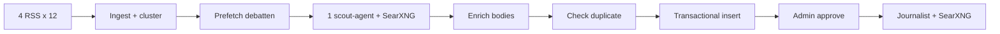

# Forum Reels v11.1 – Scout redesign

Live scout: `j6NZpV4IHP0AHFVj`  
Kilde: [`forum-research-discovery.workflow.ts`](forum-research-discovery.workflow.ts)

## Flyt



| Steg | Beskrivelse |
|------|-------------|
| **Code ingest** | VG, Dagbladet, NRK toppsaker, Aftenposten — junk-filter, **politikk-nøkkelord påkrevd**, token-overlap klynger. **Ingen DB-dedup i ingest.** |
| **Prefetch debatten** | SearXNG `site:nrk.no/debatten` for topp 2 klynger (deterministisk) |
| **Scout agent** | Velger 1 av topp 3–5 klynger; bruker prefetch, SearXNG kun ved behov |
| **Code enrich** | HTTP fetch artikkeltekst → `source_payload` jsonb |
| **Check duplicate** | Eneste hard dedup (tittel + URL-overlap ≥3) |
| **Transactional insert** | Cluster + artikler i én SQL (CTE) |
| **Cron** | `*/30 * * * *` (hver 30. min) |
| **Multi-save** | Etter vellykket insert: lagrer kandidat #2 hvis ulik. Ved duplikat: fallback til neste kandidat. |

Tom ingest logges i node **Log empty ingest** med `rss_raw`, `filtered_junk`, `filtered_politics`, `candidates_count`.

## DB (migrasjon `20260607120000_forum_scout_v11_source_payload.sql`)

- `forum_research_articles.source_payload` — excerpt, fetch_status, image_url, word_count
- `forum_research_clusters.scout_metadata` — outlets, fetch_statuses, ingest_stats, debatten_used
- `politics_score` settes ved scout-insert (prioriterer synthesis-kø)

## Deploy

```bash
npm run deploy:scout -- --publish
```

Krever `N8N_API_KEY` i `.env.local` og `@n8n/workflow-sdk` (devDependency eller `NODE_PATH`).

Webhook: `POST /webhook/folkets-forum-research-discovery`

## Admin pipeline

`/dashboard/admin/forum-prompts?tab=pipeline` viser outlets og fetch-status fra `scout_metadata`.

## Fjernet fra v10.1

- Batch cluster AI (5 og 5)
- Consolidate clusters AI
- Dedup i ingest (`recent_story_*` filtrerte bort klynger før agent)

## Delte moduler

- [`forum-scout-ingest.shared.ts`](forum-scout-ingest.shared.ts) — Code node JS
- [`forum-workflow.shared.ts`](forum-workflow.shared.ts) — SCOUT_PICK_SYSTEM, SQL
