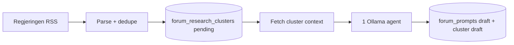

# Forum Reels v12 – Regjeringen RSS + prompt generator

Erstatter v10/v11 scout + journalist + editor med **to workflows**.

| Workflow | Live ID | Kilde | Webhook |
|----------|---------|--------|---------|
| **1 Regjeringen RSS** | `6yy1ESY2Zy7cWgtF` | [`forum-regjeringen-rss-ingest.workflow.ts`](forum-regjeringen-rss-ingest.workflow.ts) | `POST /webhook/folkets-forum-regjeringen-rss` |
| **2 Prompt generator** | `vOP2zPflfT0yBvDQ` | [`forum-prompt-generator.workflow.ts`](forum-prompt-generator.workflow.ts) | `POST /webhook/folkets-forum-prompt-generator` |

## Flyt



| Steg | Beskrivelse |
|------|-------------|
| **RSS ingest** | Henter Regjeringen RSS via **RSS Feed Trigger** (poll hvert minutt) + **RSS Read**-node, parse/dedupe, lagrer cluster (`pending`). Backup: cron `*/30` + webhook. |
| **Prompt generator** | Henter neste `pending` cluster (kilder + eksisterende prompts i én SQL), én Ollama-agent lager JA/NEI-spørsmål, transaksjonell lagring → `forum_prompts` draft + cluster `draft`. Cron `*/15`. Ingen `processing`-status. |

## Arkiverte workflows (v10/v11)

Allerede arkivert i n8n (2026-06-07):

| Rolle | ID | Status |
|-------|-----|--------|
| Scout (forum-research-discovery) | `j6NZpV4IHP0AHFVj` | archived |
| Journalist (forum-story-research) | `sb31mc2dmhIvdbRg` | archived |
| Editor (forum-story-editor) | `YY6u4GmeiZVk5R2e` | archived |

## Env

```bash
N8N_FORUM_SYNTHESIS_WEBHOOK_URL=https://n8n.heyklever.app/webhook/folkets-forum-prompt-generator
```

## Deploy

```bash
node scripts/bundle-forum-regjeringen-rss-workflow.mjs .tmp/regjeringen-rss.ts
node scripts/bundle-forum-prompt-generator-workflow.mjs .tmp/prompt-generator.ts
# RSS: MCP validate_workflow + create_workflow_from_code → node scripts/deploy-forum-v12-rss-ingest.mjs --temp-id <id> --publish
# Prompt: MCP validate_workflow + create_workflow_from_code → node scripts/deploy-forum-v12-prompt-generator.mjs --temp-id <id> --publish
```

## Test

```bash
curl -X POST "https://n8n.heyklever.app/webhook/folkets-forum-regjeringen-rss" -H "Content-Type: application/json" -d '{}'

curl -X POST "https://n8n.heyklever.app/webhook/folkets-forum-prompt-generator" -H "Content-Type: application/json" -d '{}'
```

Manuell replay med cluster-id:

```bash
curl -X POST "https://n8n.heyklever.app/webhook/folkets-forum-prompt-generator" \
  -H "Content-Type: application/json" \
  -d '{"clusterId":"<uuid>"}'
```

## Delte moduler

- [`forum-regjeringen-ingest.shared.ts`](forum-regjeringen-ingest.shared.ts) — RSS parse/filter/insert Code
- [`forum-workflow.shared.ts`](forum-workflow.shared.ts) — `FETCH_CLUSTER_FOR_PROMPT_SQL`, `PROMPT_GENERATOR_SAVE_JS`, `PROMPT_GENERATOR_SYSTEM`

## DB

Ingen ny migrasjon nødvendig — bruker eksisterende `forum_research_clusters` / `forum_research_articles` / `forum_prompts`.

Statusflyt v12: `pending` (RSS) → `draft` (prompt lagret) eller `failed`. Admin publiserer reel → cluster `finished`.
