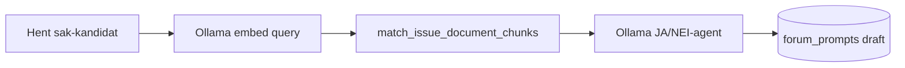

# Forum Reels v13 – Stortinget-sak RAG prompt generator

Ny pipeline som lager JA/NEI-reels **direkte fra stortingssaker** med RAG (dokumentchunks + AI-sammendrag).

| Workflow | Kilde | Webhook |
|----------|--------|---------|
| **Sak-RAG prompt generator** | [`forum-sak-prompt-generator.workflow.ts`](forum-sak-prompt-generator.workflow.ts) | `POST /webhook/folkets-forum-sak-prompt-generator` |

Kjører **parallelt** med v12 Regjeringen RSS — komplementerer nyhets-RSS med parlamentarisk substans.

## Flyt



| Steg | Beskrivelse |
|------|-------------|
| **Sak-kø** | `pending` saker med `document_chunks.embedding_status = ready`, uten aktiv/draft prompt |
| **RAG** | Embed sak-tittel+sammendrag → top 8 chunks via `match_issue_document_chunks` |
| **Agent** | Ollama `llama3.1:8b` + strukturert JSON-parser |
| **Lagring** | `forum_prompts` draft med `stortinget_issue_id` + `generation_metadata` |

## Kandidatfilter (Fase 0 — prod 2026-06-21)

| Metrikk | Verdi |
|---------|-------|
| Åpne saker (`pending`) | 66 |
| Med RAG-embeddings | 11 |
| Sak-kandidater (uten reel) | 11 |

## Env

```bash
N8N_FORUM_SAK_PROMPTS_WEBHOOK_URL=https://n8n.heyklever.app/webhook/folkets-forum-sak-prompt-generator
```

## Deploy

```bash
node scripts/bundle-forum-sak-prompt-generator-workflow.mjs .tmp/sak-prompt-generator.ts
# MCP validate_workflow + create_workflow_from_code → node scripts/deploy-forum-v13-sak-prompt-generator.mjs --temp-id <id> --publish
```

## Test

```bash
# Neste kandidat i kø
curl -X POST "$N8N_FORUM_SAK_PROMPTS_WEBHOOK_URL" -H "Content-Type: application/json" -d '{}'

# Spesifikk sak
curl -X POST "$N8N_FORUM_SAK_PROMPTS_WEBHOOK_URL" \
  -H "Content-Type: application/json" \
  -d '{"stortinget_issue_id":"200329"}'
```

## Delte moduler

- [`forum-sak-prompt.shared.ts`](forum-sak-prompt.shared.ts) — SQL, RAG merge, systemprompt, save
- [`lib/forum/sak-prompt-candidates.ts`](../../lib/forum/sak-prompt-candidates.ts) — admin kandidatliste
- [`lib/trigger-forum-sak-prompt-webhook.ts`](../../lib/trigger-forum-sak-prompt-webhook.ts) — app trigger

## DB

Migrasjon `20260621120000_forum_sak_rag_prompts.sql`:

- `forum_research_clusters.source_type` (`rss` | `stortinget_sak` | `votering` | `user_submission`)
- `forum_prompts.generation_metadata` (RAG chunks, confidence)
- `get_sak_prompt_coverage()` — admin-metrikker

## Admin

- Pipeline: `/dashboard/admin/forum-prompts?tab=pipeline` — se sak-kandidater + trigger
- Sak-side: «Generer reel-utkast» (kun forum-admin)
- API: `GET /api/admin/forum-sak-candidates`, `POST /api/admin/forum-sak-prompts`

## Review-sjekkliste (etter deploy)

1. Webhook produserer draft med `stortinget_issue_id`
2. Spørsmål er ikke overskrift-mal
3. `generation_metadata.rag_chunk_count` > 0 for RAG-grounded prompts
4. Admin kan publisere → karusell viser sak-lenke
5. v12 RSS-flyt uendret (`source_type = rss`)
