# Forum trending prompts v5 – les artikkel, forstå, formuler

Kilde: [`forum-trending-prompts.workflow.ts`](forum-trending-prompts.workflow.ts)  
Live workflow: https://n8n.heyklever.app/workflow/MloIdsnX7FozM4dv  
Webhook: `POST /webhook/folkets-forum-prompts`

## Problem v4 løste ikke

Tidligere pipeline sendte **kun RSS-tittel + kort ingress (~200 tegn)** til Ollama. Når agenten ikke passerte strenge modereringsregler, fylte workflowen med **`titleFallback`**: en mal som satte overskriften inn i sitater:

`Er du enig i at Norge bør ta tydeligere grep om «[overskrift klippet til 70 tegn]»?`

Det er ikke «forståelse» – det er string-maler.

## v5-prinsipp

1. **Hent artikkeltekst** for topp politiske URL-er (maks 12 parallelle GET).
2. **Agenten leser `Artikkel:`-utdrag** (opptil ~2400 tegn per kilde i prompt, 14k totalt).
3. **Tool `read_article_clusters`** returnerer faktisk utdrag – ikke bare titler.
4. **Ingen overskrift-mal som `active`** – `titleFallback` er deaktivert; regex-fallback går til **`draft`**.
5. **Agent-spørsmål** krever minst ~120 tegn brødtekst på primærkilde (`articleText` eller `description`).

## Pipeline

```mermaid
flowchart LR
  existing[Fetch existing prompts]
  trusted[Fetch trusted sources]
  longrun[Fetch long-running saker]
  rss[Fetch RSS headlines]
  collect[Collect all headlines]
  fetch[Fetch article bodies]
  build[Build agent input]
  agent[Generate prompts Ollama]
  mod[Moderation plus route]
  save[Save prompt]

  existing --> trusted --> longrun --> rss --> collect --> fetch --> build --> agent --> mod --> save
```



### Fetch article bodies

| Felt | Verdi |
|------|--------|
| Maks HTTP-hentinger | 12 (høyest `politicsScore` først i listen) |
| Domener | vg.no, nrk.no, aftenposten.no, dagbladet.no, e24.no, dn.no, nettavisen.no |
| Timeout | 10 s per URL |
| Ekstraksjon | JSON-LD `articleBody`, `<article>`, `<main>`, ellers strip HTML |
| Lagring | `articleText` (maks 4000 tegn), `articleFetchStatus`: `ok` / `partial` / `failed` / `skipped` |

`partial`: RSS-ingress brukes når HTML er for tynn (paywall, JS-rendering, kort side).

### Ollama-agent

- Systemprompt krever lesing av **Artikkel:**-blokker; forbyr overskrift-sitat i `question`.
- Tools: `check_duplicate`, `read_article_clusters` (erstatter `summarize_headlines`).
- `maxIterations`: 5, `numPredict`: 1600.

### Moderation

| Regel | Effekt |
|--------|--------|
| `titleFallback` | Fjernet fra fallback-løkke; returnerer `null` |
| `isHeadlineTemplateQuestion` | Avviser «tydeligere grep om» og spørsmål der «…» overlapper kilde-tittel |
| `rejectQuestion` | Blokkerer bl.a. `tydeligere grep om` |
| Ingen tom-batch fallback | Hvis agent feiler → **ingen** nye prompts (bedre enn dårlige) |
| Agent-batch | Primærkilde må ha ≥120 tegn `articleText`/`description` |
| `isFallback` (regex-regler) | `status = draft` alltid |
| Kilde-alignment | `sourceText()` inkluderer `articleText` |

## Deploy til n8n

```bash
# 1) Topology (kun første gang v5 deployes – hvis noden mangler live)
node scripts/build-n8n-forum-prompts-v5-topology-ops.mjs /tmp/n8n-forum-prompts-v5-topology-ops.json
# n8n MCP update_workflow med topology-ops

# 2) Kode + prompt
node scripts/build-n8n-forum-prompts-ops.mjs /tmp/n8n-forum-prompts-ops.json
# n8n MCP update_workflow med code-ops (ett node-oppdatering per kall hvis payload er stor)
```

## Opprydding av feilaktige aktive prompts

Kjør [`scripts/archive-misaligned-forum-prompts.sql`](../../scripts/archive-misaligned-forum-prompts.sql) eller arkiver manuelt i admin prompts spørsmål som matcher overskrift-malen.

## Begrensninger og neste steg

- **Paywall / SPA**: mange aviser returnerer tynn HTML; da blir `partial` eller `failed`. Vurder Jina Reader / Firecrawl som ekstra node hvis treff-rate er lav.
- **Modell**: `llama3.2:3b` er fortsatt begrenset; vurder større modell på spørsmålsagenten hvis JSON/tool-kall feiler ofte.
- **App**: `source_headlines` kan nå inneholde `articleFetchStatus` (ekstra felt, ignoreres av UI).

## Relatert app-kode

- Karusell: `components/forum/forum-prompt-carousel.tsx`
- Admin: `app/api/admin/forum-prompts`
- Agent-notat: `.cursor/agents/reels-prompts.md`
