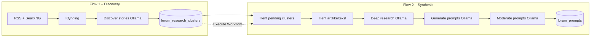

# Forum Reels v7 – to-stegs research pipeline

Kilde:
- Discovery: [`forum-research-discovery.workflow.ts`](forum-research-discovery.workflow.ts)
- Synthesis: [`forum-trending-prompts.workflow.ts`](forum-trending-prompts.workflow.ts)

## Hvorfor to flows?

Én monolittisk workflow (RSS → artikler → spørsmål i ett steg) ga for dårlige JA/NEI-spørsmål. v7 deler ansvar:

| Flow | Rolle | Output |
|------|--------|--------|
| **1 – Discovery** | Finn interessante saker i nyhetsbildet | `forum_research_clusters` + `forum_research_articles` |
| **2 – Synthesis** | Dyp research per sak, sammenlign kilder, lag spørsmål | `forum_prompts` (+ moderering som før) |

## Arkitektur



## Live workflow-IDer (n8n)

| Flow | Workflow ID | Webhook |
|------|---------------|---------|
| **Discovery** | `mjiQBSdxVv0sAuMu` | `POST /webhook/folkets-forum-research-discovery` |
| **Synthesis** | `MloIdsnX7FozM4dv` | `POST /webhook/folkets-forum-prompts` |

Etter vellykket discovery (clusters + artikler lagret) kjører **Trigger forum synthesis** (`executeWorkflow` → `MloIdsnX7FozM4dv`, `waitForSubWorkflow: false`). Hopper over når `Has clusters?` er false eller ingen saker ble lagret (`skipSave` / tom Expand).

## Database

Migrasjon: `supabase/migrations/20260603140000_forum_research_clusters.sql`

- **forum_research_clusters** – sak i kø (`pending` → `processing` → `completed`)
- **forum_research_articles** – kilder per sak
- **deep_research_json** – lagres etter flow 2

## Triggere

| Workflow | Cron | Webhook |
|----------|------|---------|
| Discovery | `0 * * * *` (kl. :00) | `POST /webhook/folkets-forum-research-discovery` |
| Synthesis | `30 * * * *` (kl. :30) | `POST /webhook/folkets-forum-prompts` |

Discovery triggerer synthesis automatisk ved suksess; cron på synthesis (`:30`) er backup hvis discovery feilet eller synthesis ble avbrutt.

## Deploy

```bash
# 1) Migrasjon
# supabase db push

# 2) Valider SDK-kode (n8n MCP validate_workflow)

# 3) Opprett discovery (ny workflow)
# create_workflow_from_code med forum-research-discovery.workflow.ts

# 4) Oppdater synthesis (eksisterende MloIdsnX7FozM4dv)
node scripts/build-n8n-forum-prompts-ops.mjs /tmp/n8n-v7-synthesis.json
node scripts/build-n8n-forum-research-discovery-ops.mjs /tmp/n8n-v7-discovery.json
# update_workflow via n8n MCP
```

## v6-dokumentasjon

Moderering, trusted sources og feedback-tabell er uendret – se [`FORUM-PROMPTS-v6.md`](FORUM-PROMPTS-v6.md).
